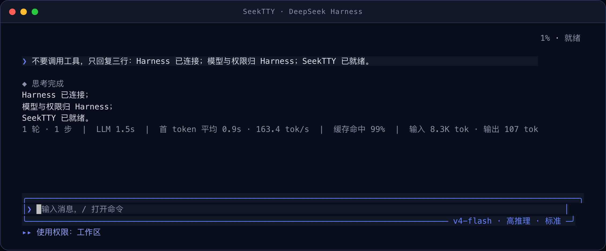
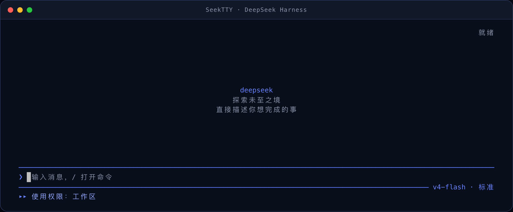
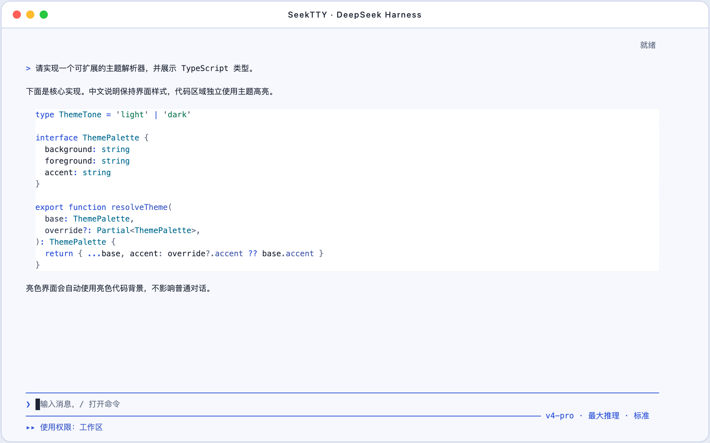
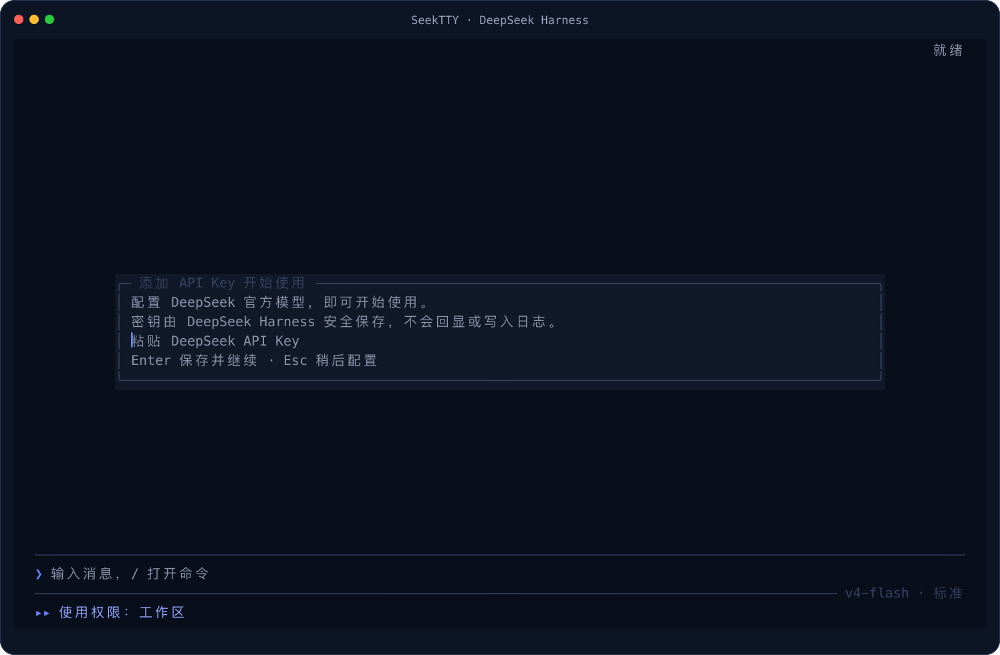
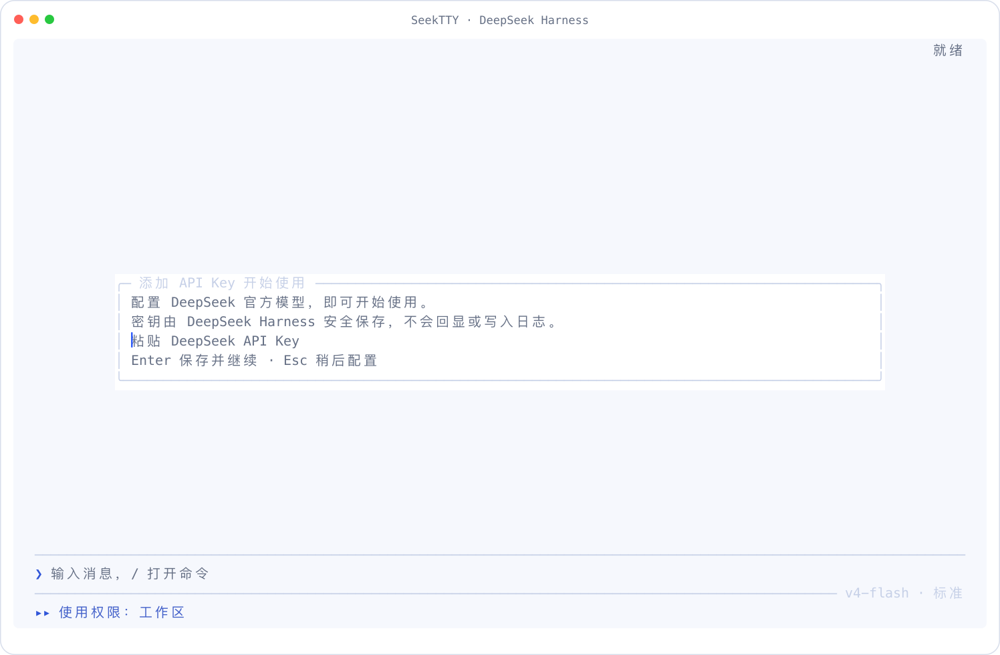

<div align="center">


<h1>SeekTTY</h1>

<p>DeepSeek Harness 的终端工作台。</p>

<p>
  <a href="https://github.com/Hilbert-beinghappy/seektty/releases"></a>
  
  
  <a href="https://github.com/Hilbert-beinghappy/seektty/actions"></a>
  <a href="LICENSE"></a>
</p>

<p>
  <a href="#项目概览">项目概览</a>
  ·
  <a href="#快速开始">快速开始</a>
  ·
  <a href="#clarify-与-plan">Clarify 与 Plan</a>
  ·
  <a href="#功能">功能</a>
  ·
  <a href="#兼容与验证">兼容性</a>
</p>

<p><a href="README.md">English</a> · 中文</p>

</div>

---

## 项目概览

进入项目目录运行 `deepseek`，即可在一个终端工作台中使用 [DeepSeek Harness](https://github.com/deepseek-ai/deepseek-harness) 原生的 Agent、Session、模型、权限、Settings、Profile、插件与持久化服务。SeekTTY 只负责终端界面；运行状态始终由 Harness 持有。

模型、Provider、Agent Preset、权限、命令、工具、Settings、Skill、MCP 服务和插件来源均从正在运行的 Harness 动态读取，因此上游或第三方 Bundle 新增的能力不需要硬编码进 SeekTTY。

需求还需要澄清时，可选的 [Clarify Host 插件](https://github.com/Hilbert-beinghappy/dsh-plugin-clarify) 会加入引导式 `/clarify` 工作流：逐一提出聚焦问题，每次回答后更新可审阅的 Draft，并把采用后的 Draft 写回输入框。随后可用 Harness 原生 `/plan` 把正式提交的需求整理成实施方案。

## 快速开始

在已测的官方 DeepSeek Harness `0.1.1-rc.2` 上安装 SeekTTY：

```sh
pnpm add --global --config.enable-global-virtual-store=false @deepseek-ai/dsh@0.1.1-rc.2

dsh plugin --profile tui add --config.enable-global-virtual-store=false seektty@1.2.5

dsh --profile tui
```

这些命令通过原生 `dsh plugin` 协调机制安装预构建 Bundle。逐命令 pnpm 参数会避开 pnpm 11 Global Virtual Store 布局；当前已测 dsh 版本的 Cordis Loader 还不能可靠加载该布局。SeekTTY 绝不会修改全局 pnpm 配置。Clarify 与 Auxiliary Runtime 均为可选插件，不是默认依赖；历史联合验收组合见[兼容性](#兼容与验证)。

`seektty@1.2.5` npm 包与 GitHub Release tarball 使用同一份已审核包输入构建。[1.2.5 Owner 审核与发布清单](docs/release-v1.2.5-verification.md)记录发布和验证流程。

### 裸 `deepseek` 启动器

安装 `dsh` 后，可全局安装同一个 SeekTTY Release，并把 Profile 协调固定到精确 npm 版本：

```sh
pnpm add --global --config.enable-global-virtual-store=false seektty@1.2.5
export SEEKTTY_SPEC=seektty@1.2.5
deepseek
```

PowerShell 使用相同的精确 npm spec：

```powershell
pnpm add --global --config.enable-global-virtual-store=false 'seektty@1.2.5'
$env:SEEKTTY_SPEC='seektty@1.2.5'
deepseek
```

`deepseek` 要求 `dsh` 位于 `PATH`，也可以用 `DSH_BIN` 指向其可执行文件。常用启动形式包括：

```sh
deepseek "检查这个项目"
deepseek --cwd ../project
deepseek --resume
deepseek --resume <sessionId>
deepseek --profile team-tui
deepseek --version
deepseek --update
```

`deepseek --update` 采用 SeekTTY 自更新优先策略：先检查 SeekTTY，再检查 dsh；每轮最多安装一个兼容组件，绝不自动安装未测试的 gap 或未来 Host。`DSH_BIN`、本地安装和 `SEEKTTY_SPEC` 覆盖不会被改写，更新失败也不会阻止启动。设置 `SEEKTTY_UPDATE=check` 可改为会话后提示，设置 `SEEKTTY_UPDATE=0` 可关闭检查。

SeekTTY `1.2.5` 为官方 Harness `0.1.1-rc.2` 带来 Fastfetch 风格欢迎页、终端背景融合、VS Code 视觉级 TextMate 高亮、更可靠的对话与选择控件，以及 pnpm 11 安装兼容，无需迁移 Settings 或 Session。

### 1.2.5 新增内容

- 空会话显示响应式 DeepSeek 像素鲸鱼欢迎页与 Profile 运行信息；`/welcome` 可配置自定义信息行、可选的安全／受信任 Fastfetch 信息、内置／文件／本机 Fastfetch Logo、混合顺序、实时预览、刷新与重置，欢迎内容不会写入 Session 历史。
- 主画布可通过 `theme`、`terminal` 和向后兼容的 `explicit` 三种背景模式继承终端透明、模糊和背景图片；overlay、panel 与普通代码表面使用同一继承策略，并补充对比度适配和退出时终端颜色恢复。
- 导入的 VS Code `tokenColors` 成为权威规则，内置主题补齐精细 TextMate 配色，旧主题获得兼容的细粒度兜底；高亮按语言 grammar 区分，但明确不冒充 LSP 语义高亮。
- 实时与已完成的思考块均可折叠，流式更新不会重新展开用户手动收起的内容；修正对话控件点击行偏移，工具卡收起后不再残留参数与结果。
- 权限切换会检查 Harness 原生命令结果并刷新权威状态；模型、推理强度和 Agent 模式拆成独立点击与选择入口，并新增 `/effort` 键盘入口。
- 宽弹窗会使用可用空间显示完整选项描述，resize 时保留搜索、选中、滚动与鼠标命中；多层控件的 hover 和透明表面语义保持一致。
- 启动器协调、兼容更新和 TUI 插件变更逐命令关闭 pnpm 11 Global Virtual Store。已知 `store/v11/links` Loader 故障会得到精确且脱敏的恢复提示，不修改全局 pnpm 配置，也不绕过原生 Profile 协调。

完整变更见双语[发布说明](docs/release-v1.2.5.md)，验证边界与发布流程见 [Owner 审核清单](docs/release-v1.2.5-verification.md)。

## 界面预览

| DeepSeek 亮色 | DeepSeek 暗色 |
| --- | --- |
|  |  |

| 亮色界面中的 TypeScript | 暗色界面中的工具、文件读取与 Diff |
| --- | --- |
|  |  |

最新视图使用固定高度的 alternate screen，把输入框和状态栏固定在底部。已发送的用户消息复用输入框的上下细线，与不加边框的模型回复区分。完整鼠标模式用滚轮浏览历史、选择文本，并点击已有控件。把选区拖到 Transcript 边缘并停留会自动跨已加载页面滚动，同时保持同一个逻辑文本锚点；每帧仍只重绘当前可见窗口。F3 或 `/mouse` 可切到原生终端选择且不离开备用屏幕；退出后恢复原主屏幕及其滚动记录。助手代码、Shell 指令、工具参数、文件读取、JSON 和 Diff 共用当前代码主题，普通对话文字仍使用界面主题。

空会话现在显示响应式 Fastfetch 风格欢迎页，不再提供可发送的任务候选。默认使用随包发布的原色 DeepSeek 像素鲸鱼，并显示当前 Profile 的运行信息；默认**不会**执行 Fastfetch。首次 API Key 引导仍具有更高优先级，完成后才会开始可选的 Fastfetch 采集。

## Clarify 与 Plan

Clarify 与 Plan 位于同一条工作流的前后两段：Clarify 帮助确认**要做什么**，Harness 原生 Plan 提议**如何实现**。

| 组件 | 职责 |
| --- | --- |
| **SeekTTY** | 探测 Clarify Remote，加入 `/clarify`，渲染终端交互，提供当前 Session 与草稿，并把采用后的 Draft 写回输入框。 |
| **dsh-plugin-clarify** | 持有临时澄清进程，通过 `clarify.wire/1` 发布 `start`、`answer`、`accept`、`refine`、`cancel` 和 `fetchDraft`。 |
| **dsh-plugin-auxiliary-runtime** | 通过当前模型路由运行 Clarify 模型调用，并提供限额、取消与独立用量账本。 |

可通过以下方式启动 Clarify：

- 从命令面板选择 `/clarify`，以整个输入区作为 seed；
- 输入 `/clarify some text`，以参数文本作为 seed；
- 在现有草稿末尾单独加入 `/clarify` token 或一行，以前面的文字作为 seed。

Clarify 一次提出一个聚焦问题，把已确认的决定带入后续问题，并在每次回答后刷新 Draft 预览。你可以回答、refine、采用或取消。采用只会把 Draft 写入普通输入框；按 Enter 仍是明确的发送动作。正式提交后，如需实施方案再运行 `/plan`。

问题、选项、预览和 refine 反馈保留在 Host 内存中，默认 15 分钟无交互后失效。主 Session 只会收到你明确发送的 Draft。辅助用量写入官方 `storageDomain` 下的 `auxiliary_runtime`；prompt、回答、模型输出、凭据和文件路径不会进入账本。`/status` 会显示经过校验的 Official、Auxiliary 和派生 Combined 总量，同时保持官方 Agent `tokenUsage` 不变。

已验收 Release 组合与当前候选边界见[兼容与验证](#兼容与验证)。

## 功能

| 范围 | 可用操作 |
| --- | --- |
| 对话 | 流式 Markdown/GFM、语法高亮代码、链接、表格、推理显示、工具卡片模式、重试、上下文压缩、取消与错误状态 |
| Session 与工作区 | 新建、恢复、搜索、重命名、Fork、归档、排序、复制、导出和切换工作区，不删除项目文件或日志 |
| Agent、模型与权限 | 动态 Agent Preset、Provider、模型、推理强度和权限预设，支持按 Session 切换与诊断 |
| 队列与交互 | Agent 运行时继续排队或 steer；编辑队列项；处理单选、多选、自定义、跳过、取消和计划审查 |
| 图片 | 粘贴或附加 PNG、JPEG、GIF、WebP；执行 Host 动态限制；恢复待发送附件；终端支持时内联显示 |
| Plan、Goal、Todo 与压缩 | 原生 `/plan`、`/goal`、`/compact`，包含计划审查、目标状态、Todo 数量和 transcript 记录 |
| 工具与文件 | 工具耗时、参数与结果高亮、带原文件行号的读取、Shell/JSON/Diff、产出文件浏览、路径复制与确认后外部打开 |
| 子 Agent 与后台工作 | 浏览所属根 Session 的嵌套 Agent Tree，打开独立 child transcript，返回时恢复父视口、草稿、附件与树状态；Host 证据不足时保守显示生命周期与可继续状态 |
| Profile 与 Settings | 创建、复制、切换和诊断 Profile；通过 Schema 回退、revision 检查和只写 Secret 编辑全部设置命名空间 |
| 插件、Skill 与 MCP | 插件中心、原生 Bundle 协调、动态 Skill 命令、MCP 实例、加载状态、设置与风险信息 |
| 主题与语言 | 界面／代码主题独立切换、继承终端背景效果、配色生成、VS Code 主题导入、对比度检查、`NO_COLOR` 和中英文实时切换 |
| 欢迎页 | 响应式 DeepSeek 像素鲸鱼终端 Logo、自定义信息行、可选 Fastfetch 数据、草稿实时预览和带 revision 保护的 Profile 设置 |
| 诊断与反馈 | 运行状态、可执行的 `/doctor` 检查、Session 反馈、助手消息评分与反馈删除 |

SeekTTY 从当前 Harness Profile 动态读取这些目录。暂不支持的可选能力会安全降级，专用终端界面则可以持续演进。

权限切换使用原生 Host 命令及其执行结果。成功后菜单关闭，失败时在菜单内保留错误供重试；完全访问与未知风险预设仍需确认，切换会话后必须重新选择权限。命令适配器支持已挂载的旧版双参数契约，以及官方 dsh `0.1.1-rc.2` 的三参数 `images` 契约；遇到未知契约直接拒绝，不换参数重试命令。

## 首次配置 API Key

| 暗色 | 亮色 |
| --- | --- |
|  |  |

当前 Profile 没有可用模型 Provider 时，SeekTTY 会提供 DeepSeek 官方快捷配置、共用 Provider 管理器和**稍后配置**。环境凭据、Harness 已存凭据，以及活跃的环境认证或无 Key Provider 都会跳过该引导。通用 Provider 保存后，必须明确选定当前 Session 模型，待发送请求才会继续。

输入内容始终显示为掩码，并直接交给 Harness `credentials.set`。SeekTTY 不会读回密钥，也不会把它放入 Settings、日志、截图或 Session 数据。保存时不会发起可能计费的验证请求；认证错误由第一次真实请求通过正常 Provider 路径报告。

按 Escape 可稍后配置，同时继续使用 `/settings`、`/plugin` 等本地界面。待发送文字和附件都会保留，配置完成后自动继续原请求。如果 Provider 状态无法检查，SeekTTY 会提示使用 `/settings` 与 `/doctor`，而不是显示无法使用的表单。

## Provider 管理

可从 `/model` 的**管理 Provider…**进入，也可从 `/settings` 的**模型与 Agent**进入。两个入口与首次引导共用同一套 Harness 流程：合并 `llm.providers`、`settings.describe` 和不含凭据值的 `credentials.describe`；先执行带 revision 保护的 Settings mutation，再可选调用 `credentials.set`；修改后重新读取官方模型目录。仅保存配置不会暗中修改当前 Session 或新 Session 默认模型。

自定义 Provider 仅使用已安装 `llm-pi-ai` adapter 在 schema 中明确描述的 `providers` 字典。在官方 dsh `0.1.1-rc.2` 中，它公开的协议选项是 OpenAI Chat Completions、OpenAI Responses 和 Anthropic Messages。所有协议都可手工录入模型；adapter 支持时可通过 `llm.discoverModels` 发现。获取到模型列表只证明配置发现成功，第一次真实请求才是认证和推理检查。

API Key 始终通过掩码控件收集，且只交给 Harness Credentials。来自环境或文件的只读凭据只显示为外部管理；凭据元数据不可读时，Key 更新按 fail-closed 禁用。同时修改 endpoint 与 Key 时，必须使用不同、未配置且可写的新 Credential Ref；Settings 会在同一次 mutation 中切换地址与 Ref，随后才写入新 Key，因此旧 Key 不会被路由到新地址。模型编辑保留 schema 描述的完整模型项，包括输入模态、推理强度和协议兼容字段。

删除仅适用于既非权威当前 Session 路由、也非默认路由的用户层自定义 Provider；即使当前路由未出现在模型目录中也会受到保护。确认后会重新读取引用与所有权，并核实删除结果；凭据与历史 Session 均不改动。已保存的 Provider ID 不支持原地重命名。Catalog Provider 和专有认证仍受已安装 Harness adapter 实际公开能力限制；该界面不是协议转换器，也不代表所有厂商专有 API 均已认证。

## 斜杠命令

在输入框键入 `/` 会打开可搜索菜单，合并 SeekTTY 命令、当前 Agent 的 Host 命令和用户可调用的 Skill。

| 分类 | 命令 |
| --- | --- |
| Session | `/new`、`/resume`、`/sessions`、`/rename`、`/fork`、`/archive`、`/export`、`/export md`、`/copy` |
| 工作环境 | `/workspace`、`/profile` |
| Agent | `/mode`、`/model`、`/permission`、`/plan`、`/goal`、`/compact` |
| 运行交互 | `/queue`、`/steer`、`/attach`、`/attachments`、`/pending` |
| 运行内容 | `/tools`、`/files`、`/jobs`、`/subagents`、`/trajectory` |
| 扩展 | `/plugin`、`/plugins`、`/skills`、`/mcp` |
| 插件工作流 | 兼容的 Clarify Remote 与 Auxiliary Runtime 激活后出现 `/clarify` |
| 配置与诊断 | `/settings`、`/language`、`/theme`、`/welcome`、`/status`、`/doctor`、`/feedback`、`/restart` |
| 帮助与退出 | `/help`、`/quit`、`/exit` |

`/plugin`、`/workspace` 和 `/profile` 同时提供交互中心与直接子命令。未知命令不会作为普通消息发送，而会留在命令界面并显示相近建议。

自动补全与弹窗列表保持滚动位置：滚轮只浏览、不改变选中项，点击可见行不会让它居中，方向键仅在选中项越过可见边缘时滚动。悬停只做预览。首次单击选中；之后再次点击同一个仍待激活的选项，不受双击时间限制。按 Enter 或安全地再次点击会补全并且只执行一次斜杠命令；Tab 只补全。文件和路径补全永不自动提交，滚动位置提示行不可点击。

弹窗底部提供单击生效的选择／确认／保存和返回／关闭按钮，悬停样式跟随主题。按钮与键盘共用校验、导航逻辑；危险确认仍只能通过键盘完成。普通鼠标操作启动后即可使用，无需先最小化终端。终端支持焦点上报时，恢复焦点后的 250ms 内会防止误触执行。

完整鼠标模式复制会把文本统一编码一次为 UTF-8。Windows 使用固定的 PowerShell `Set-Clipboard` writer，macOS 在 UTF-8 locale 下运行 `pbcopy`，Wayland 明确声明 `text/plain;charset=utf-8`，X11 明确请求 `UTF8_STRING`；OSC 52 继续服务于终端、SSH 与 tmux 路径。

## 设置中心

`/settings` 不再平铺技术命名空间和字段，而是按产品用途组织为：**外观**、**欢迎页**、**鼠标与滚动**、**输入与快捷键**、**模型与 Agent**、**权限与安全**、**插件与扩展**、**语言与系统**。现有 Harness 命名空间和持久化值保持不变；兼容场景仍可使用 `/settings <namespace>` 直接打开技术命名空间。

**模型与 Agent**分类包含共用 Provider 管理器和现有的默认模型选择器。未知的非 Secret Settings 字段仍可从通用 schema 编辑器访问；Provider 管理不会替换或隐藏无关的 `llm-pi-ai` 字段。

专用编辑器遵循同一返回规则：列表操作后留在列表，叶子字段完成后返回一层，Esc 每次只退一层，只有保存／取消才退出草稿事务；新增、删除和移动后保持最合理的焦点。欢迎页的 Logo、Fastfetch、自定义信息行与安全模块排序均采用该规则。

## 欢迎页

`/welcome` 打开空会话欢迎页的事务式编辑器；`/settings seektty-welcome` 复用同一个界面。所有修改先留在草稿中，只有选择**保存并立即应用**后才会按 Settings revision 一次写入并实时生效。按 Escape 或选择**取消全部修改**不会改变当前欢迎页。

信息模式：

| 模式 | 行为 |
| --- | --- |
| `custom`（默认） | 结构化标题、文字、固定字段、运行信息、分隔线、空行和主题色板；绝不运行 Fastfetch |
| `fastfetch` | 显示从 `PATH` 中已有 `fastfetch` 解析出的信息 |
| `mixed` | 按“自定义优先”或“Fastfetch 优先”顺序同时显示两类内容 |

默认运行信息包括 SeekTTY 版本、工作区、模型、推理强度、Agent 模式、权限和主题。欢迎内容只属于临时界面状态，不写入 Session 或聊天记录；Session 出现第一条持久会话内容后立即隐藏。内容高于窗口时使用 transcript 滚动，不会静默截断；resize 和主题切换只重新排版、重新着色，不重复执行 Fastfetch。

内置大图与紧凑图是对 MIT 授权的 `seek-on-dsh` DeepSeek 像素鲸鱼进行的预生成终端转换；固定的源代码版本与许可说明记录在 `THIRD_PARTY_NOTICES.md`。原色模式保留蓝白配色，主题模式则把蓝色映射为 `brand`、白色映射为 `text`。SeekTTY 不负责生成像素画，也不使用 Kitty、iTerm、Sixel 等图像协议。用户可提供 UTF-8 终端文本文件：原色模式仅保留安全解析后的 ANSI 颜色，主题模式兼容 Fastfetch `$[1-9]` 前景色槽，`$$` 表示字面量 `$`。第四种 Logo 来源可直接复用本机 Fastfetch 配置渲染的 Logo：SeekTTY 强制使用空模块结构，只采集一次 Logo，保留原始 ANSI 颜色，清理后再参与欢迎页排版；该过程不会执行 Fastfetch 信息模块或 `command` 模块。光标移动、清屏、OSC/DCS、超链接、剪贴板和图像协议都会被移除。文件及采集结果限制为 256 KiB、256 列、120 行；来源无效或不可用时回退内置 Logo，并只提示一次。

Fastfetch 始终是可选项，SeekTTY 不安装也不下载它。安全信息来源直接以 argv 启动已有程序，不经过 Shell，强制使用 `--config none`，关闭 Fastfetch Logo 与颜色，并提供可排序的隐私安全模块。受信任的用户配置信息来源可能包含 `command` 模块或其他外部行为，启用前必须明确确认风险。Logo 复用独立于信息模式，使用同一个可选 Fastfetch 配置路径，留空则使用 Fastfetch 默认配置。所有采集均采用 2 秒超时、有限输出和控制序列清理。同一配置每个进程只采集一次；`/welcome refresh` 同时清除信息与 Logo 缓存并重新采集，`/welcome reset` 恢复默认的不运行 Fastfetch 配置。

自动化覆盖与真实终端边界见[实施与兼容验收记录](docs/fastfetch-welcome-acceptance.md)。

## 常用操作

F1 → **键位速查** 按用途展示当前绑定，并反映 `/keymap` 自定义。以下为默认键位：

### 输入与编辑

| 输入 | 操作 |
| --- | --- |
| Enter / Shift+Enter | 发送或确认；选中的斜杠候选会补全并只执行一次 / 输入换行 |
| Ctrl+Z（兼容 Ctrl+-） | 撤销当前输入框内的编辑，包括输入、粘贴和选区替换 |
| Ctrl+R | 搜索输入历史 |
| 多行弹窗中的 Enter / Ctrl+Enter | 换行 / 提交 |

各输入框独立保留撤销记录，包括搜索框和遮蔽的密钥输入框。撤销不会撤回已发送消息或回退已保存设置。

### 命令与弹窗

| 输入 | 操作 |
| --- | --- |
| 输入框中的 `/` | 打开命令与 Skill 候选 |
| Up / Down | 移动候选或列表中的选择 |
| 候选显示时按 Tab | 只补全选中的候选而不提交 |
| Escape | 取消候选，或返回／关闭当前弹窗 |
| 多选弹窗中的 Space | 勾选或取消当前项 |
| F1 / Ctrl+P | 打开帮助 / 打开命令面板 |
| F2 / Ctrl+, / Cmd+, | 打开 Settings |

### 对话浏览

| 输入 | 操作 |
| --- | --- |
| Tab | 空输入框进入对话浏览；浏览时返回输入框 |
| Up / Down | 浏览时逐行滚动或移动卡片选择 |
| PgUp / PgDn / Home / End | 在 transcript 中翻页、跳到最早内容或回到最新 |
| Shift+Left / Shift+Right | 跳到上一个或下一个用户轮次 |
| `/`，再按 Enter，然后 n / N | 查找对话、确认查询，再跳到下一个 / 上一个匹配 |
| Escape | 依次退出查找、卡片聚焦，再返回输入区 |
| Ctrl+O / Ctrl+T | 切换工具卡片显示 / 显示或隐藏推理 |

### 会话与运行

| 输入 | 操作 |
| --- | --- |
| Ctrl+S | 打开 Session 恢复 |
| Ctrl+M | 打开模型选择（需扩展键盘协议，否则使用 `/model`） |
| Shift+Tab | 循环权限预设，进入完全访问前确认 |
| Ctrl+C | 停止当前轮次、清空草稿，或二次确认退出 |

### 鼠标与选区

| 输入 | 操作 |
| --- | --- |
| F3 或 `/mouse toggle` | 切换完整鼠标模式与终端原生选择 |
| 鼠标滚轮 / 触控板 | 在 SeekTTY 内部浏览 Transcript，不改变输入框焦点、草稿、选区或光标 |
| Ctrl+Shift+C | 复制当前应用内选区 |
| 非密钥弹窗输入框中的 Ctrl+X | 剪切选区 |
| 可编辑输入框中的 Backspace / Delete | 删除选区 |
| 按住终端选择修饰键并拖动，再复制 | 原生选择：Terminal.app 按住 `Fn`、iTerm2 按住 `Option` 后拖选，再按 `Command+C`；其他终端或 tmux 使用外层终端的选择修饰键 |

完整鼠标模式还提供常驻滚动条、应用内选区、选后复制、悬停反馈，以及卡片、示例、候选、弹窗和模型／模式／权限控件的精确点击。危险确认仍需 Enter。

Transcript 复制的是语义文本，而不是终端单元格快照：视觉折行会按源空白重新连接，源文本换行与代码真实缩进会保留；渲染器行尾填充、代码 gutter 与行号、引用／界面边框、滚动条、背景填充和 ANSI／OSC 控制序列不会进入剪贴板。选后复制、Ctrl+Shift+C 与右键“复制所选文本”共用同一份 `\n` 换行 payload；终端原生选择行为不变。

弹窗中的可见文字支持拖选和复制。搜索框与非密钥输入框还支持通过输入文字、Backspace 或 Delete 替换／删除选区，Ctrl+X 剪切；右键菜单提供复制、剪切、删除选区、粘贴和全选。Ctrl+Shift+C 复制当前弹窗的选区，Ctrl+C 保留中断行为。剪贴板操作不会暴露被遮蔽的密钥。

右键菜单独立浮在当前页面上，不进入页面返回栈。它根据鼠标下方的语义对象提供操作，不移动列表箭头或键盘焦点：会话、工作区、Profile、主题、欢迎页信息行、Fastfetch 模块、排队消息、插件、文件、后台任务、子 Agent、卡片、Agent 树、MCP、Skill、状态控件和可编辑文本都会在适用时复用现有动作。每个根菜单固定保留“复制所选文本”和“关闭”；没有选区时复制置灰。原生选择继续通过 F3 或 `/mouse` 切换，不放进右键菜单。

对象菜单支持一级子菜单。悬停父项 250ms 后展开，单击、Enter 或右方向键立即展开，左方向键或 Esc 返回根菜单。执行前会重新校验目标和能力状态，刷新后消失的旧行不能继续执行；会话重命名、Fork、导出和归档直接作用于右键命中的会话，不会临时切换当前会话。破坏性动作继续使用原有确认流程，不能绕过只能按 Enter 执行的确认页。

左键点击菜单外或按 Esc 只关闭菜单；右键点击菜单外则针对新目标重新打开。菜单项单击左键即可执行，底层页面保留草稿和选区。

滚动滚轮或按住左键拖动会关闭菜单，并立即在下层页面继续滚动或选中文字；按住右键拖动则在松手位置打开菜单。左键单击菜单外仍只关闭菜单，不会误触底层控件；父弹窗继续拦截输入，不会穿透到会话。

## 主题与语言

SeekTTY 默认使用 DeepSeek 暗色主题。`/theme` 会打开主题中心，也可直接输入：

```text
/theme dark
/theme light
/theme code [auto|dark|light|<主题名>]
/theme use <主题名>
/theme edit [主题名]
/theme palette [主题名]
/theme import [主题名] [本地文件]
/theme delete <主题名>
```

界面主题与代码主题仍可独立选择。输入 3–16 个 HEX/RGB 颜色即可生成亮色与暗色候选。内置代码主题为常见编程语言、标记语言与结构化数据提供精细 TextMate 规则。`/theme import` 会读取本地 VS Code JSON/JSONC，解析相对 `include`，将可移植的 TextMate 颜色、选择器优先级与样式原样作为权威语法规则，并在确认保存后同时应用到界面与代码；只有不含 `tokenColors` 的主题才使用 SeekTTY 的紧凑角色色生成兜底规则。所有自定义路径都会先预览，并在保存前标出低对比度。定义保存在带 revision 保护的 `seektty-appearance` Harness Settings 命名空间中。

悬停是由当前界面主题统一派生的纯前景交互状态：使用主题 `brand` 色，不填充背景，不使用下划线、粗体、反色或额外标记，也不新增必填设置或修改保存的配色。选中态继续使用更强的背景填充；仍遵守 `NO_COLOR`。

主画布现在默认采用**主题颜色＋终端效果**，不再显式铺满 RGB 底色，而是使用终端默认背景，让终端应用已有的透明、模糊或背景图片效果。在 `/theme` 或 `/settings seektty-appearance` 中选择**背景模式**，两处共用同一个编辑器，保存成功后立即生效。

| `backgroundMode` | 主画布、弹窗面板与代码基础背景 | 终端颜色 |
| --- | --- | --- |
| `theme`（默认，兼容缺少该字段的旧设置） | 终端默认背景（`SGR 49`） | 通过 OSC 11 临时同步界面主题颜色 |
| `terminal` | 终端默认背景（`SGR 49`） | 不改色；如果本次运行改过色，恢复捕获的原色 |
| `explicit`（兼容） | 保留原有画布、面板与代码主题显式底色 | 保留原有 OSC 11 同步行为 |

在 `theme` 和 `terminal` 中，补齐整行的弹窗面板，以及行内、围栏、工具、文件和 Diff 代码的基础背景都与主画布一样使用终端默认背景。代码排版与语法前景色不变；选区和 TextMate 明确配置的特殊 token 背景仍是彩色区域，hover 只改变前景色。`explicit` 保留原有画布、面板和代码填充，但显式颜色是否不透明仍由终端决定。背景模式属于 Harness 的 `seektty-appearance` 设置，不属于主题文件，切换、预览、导入或导出主题均不会覆盖它。

主画布文字会适配已知且与主题不同的背景；背景未知或同步不可用时，使用终端默认前景色，不猜黑白。这时默认背景单元上的语义配色会减少，但文字样式、选区与显式 token 背景保留。已有消息也会同步更新，不移动视口或清除选区。打开的主题菜单在保存或从子菜单返回后，会刷新“当前”标记和代码主题说明。

改色需要支持的真彩色终端，并在一次 500 ms 异步查询内收到有效回复。不支持、查询超时、`NO_COLOR`、低色彩及 tmux/screen 均不改色。`theme` 模式同步不可用时保留终端默认背景，给一次非阻塞提示，不自动回退成 RGB 铺底。`SEEKTTY_TERMINAL_BACKGROUND=off` 只禁止改色，不改变所选模式。退出时恢复捕获的原色。SeekTTY 不读取／设置透明度，不修改终端配置或窗口装饰。详见[兼容性说明](docs/terminal-background-compatibility.md)与[当前验收记录](docs/transparent-surfaces-hover-acceptance.md)。

使用 `/language` 或直接命令实时切换终端文案：

```text
/language auto
/language zh
/language en
```

显式偏好由官方 locale 插件存入 `locale.preference`，并与 Harness Web 共享。`auto` 会删除覆盖并跟随终端语言环境。切换只改变 SeekTTY 界面和 transcript 呈现，不会改写模型、工具、用户、Provider 或插件生成的内容。

## 插件中心

`/plugin` 打开当前 Profile 的插件中心，`/plugins` 是别名。直接子命令包括 `list`、`search`、`info`、`install`、`remove`、`update`、`reorder`、`source` 和 `doctor`。

- 默认搜索 npm，也可添加 JSON/HTTP Catalog，或使用其他 Bundle 注册的来源；
- 支持 npm 包名、Git URL、tarball、file URL 和本地目录；
- 安装前检查 `dsh.bundle.patch`、包内文件、安装 spec、构建脚本和目标 Profile；
- 变更后可重启，并恢复工作区、Session、草稿和附件；
- 可查看版本、来源、发布者、Bundle 顺序、加载状态和可执行诊断。

TUI `/plugin` 与原生 `dsh plugin` 会协调同一份 Profile 依赖、Bundle 顺序和 pnpm lockfile。

## 迁移与移除

旧版 `deepseek-tui` 全局包只需替换一次：

```sh
pnpm remove --global --config.enable-global-virtual-store=false deepseek-tui
pnpm add --global --config.enable-global-virtual-store=false seektty@1.2.5
export SEEKTTY_SPEC=seektty@1.2.5
deepseek
```

自定义 Profile 会在首次启动时分别迁移。只使用 dsh 原生入口时，可显式替换 Bundle：

```sh
dsh plugin --profile tui remove --config.enable-global-virtual-store=false deepseek-tui
dsh plugin --profile tui add --config.enable-global-virtual-store=false seektty@1.2.5
```

如需同时移除 Profile Bundle 和可选的全局启动器，可执行以下命令；dsh 本体不受影响：

```sh
dsh plugin --profile tui remove --config.enable-global-virtual-store=false seektty
pnpm remove --global --config.enable-global-virtual-store=false seektty
```

## 兼容与验证

当前已测 Host 是官方 `0.1.1-rc.2`；完整兼容边界汇总如下。

| 边界 | 版本 |
| --- | --- |
| Node.js | `^22.19.0 || >=24` |
| 声明的最低 Harness Host | `0.1.0-rc.6` |
| 当前已测 Harness Host | `0.1.1-rc.2` |
| pnpm 11 布局适配器 | pnpm `11.7.0`；dsh `>=0.1.0-rc.6 <=0.1.0-rc.8 || 0.1.1-rc.2`；每次变更单独关闭 GVS |
| 最近一次联合验收的 Clarify Release 组合 | dsh `0.1.0-rc.8` + SeekTTY `1.2.0` + Auxiliary Runtime `0.1.0` + Clarify `0.2.1` |
| 当前 Release | SeekTTY `1.2.5` + 官方 dsh `0.1.1-rc.2`；包含外观、高亮、交互与 pnpm 布局改动，但不扩展可选插件联合验收范围 |

低于声明最低版本的 Host 会被拒绝；高于已测版本的 Host 可以在提示后启动，但自动更新只会安装明确兼容的范围。发布 Bundle 不会把 Cordis 或身份型 `@deepseek-ai/dsh-*` 包安装进 Profile：optional peer 用来描述 Host 合同，运行时 import 统一从官方 Harness 安装解析。附件兼容适配器只处理精确测试过的旧版图片限制形状，遇到未知形状会直接拒绝适配。

### pnpm 11 Global Virtual Store 兼容

pnpm 11 可能把全局包放到 `store/v11/links`。当前已测的 dsh/Cordis Loader 会在 SeekTTY 启动前因该布局报出 `plugin tree failed to load`、`cordis:include` 等错误。在上游 dsh 新版本通过 GVS 正向生命周期门禁前，SeekTTY 仅对自身发起的包树变更附加 `--config.enable-global-virtual-store=false`：启动器首次协调、兼容范围内的自动更新，以及 TUI `/plugin` 的安装、更新、移除和协调。只读 pnpm 命令不受影响。

该适配器不会运行 `pnpm config set`、设置 `NODE_PATH`、复制 Host 包，也不会绕过原生 dsh 协调去编辑 Profile manifest。启动失败且安装路径明确位于 `store/v11/links` 时，启动器会输出谨慎的双语诊断和精确的逐命令恢复方式，不会误报为 SeekTTY 缺少普通依赖。

门禁合同、当前本机证据和适配器退出条件见双语的 [pnpm 11 布局验收记录](docs/pnpm11-layout-acceptance.md)。

1.2.5 Release 候选检查覆盖：

- typecheck、单元／集成测试、生产构建、打包内容检查和重复 Host 包拒绝；
- 使用同一候选 tarball，在未修改的官方 dsh `0.1.1-rc.2` 上隔离执行 add、boot、remove、re-add；
- Windows、macOS、Linux 上使用共享候选包和 Node 22/24 的 CI 矩阵：GVS=false 必须通过完整生命周期；GVS=true 必须成功启动，或准确复现并分类已知 dsh/Cordis Loader 错误。CI runner 验证与真实终端人工签收分开记录；
- Windows ConPTY 的启动、斜杠导航、右键菜单手势交接、resize 与正常退出。注入的 PTY 输入和模拟渲染测试不等价于真实 GUI 终端鼠标或剪贴板测试；
- 十万行结构性 TUI 性能门禁。各平台人工签收状态在 [Owner 审核清单](docs/release-v1.2.5-verification.md)中单独列明。

此前的 Clarify、附件、Vision-Exp、鼠标输入与 Provider 观察属于历史证据，不代表 1.2.5 对这些可选工作流重新验收。声明的 Host 范围不变；本候选版本的 stock 生命周期复测针对 `0.1.1-rc.2`，并非所有旧版 Host。

可复用检查：

```sh
pnpm run check

DSH_BIN=/path/to/dsh \
SEEKTTY_SPEC=/path/to/seektty.tgz \
pnpm test:stock

pnpm test:pnpm11-layout false /path/to/candidate-directory
pnpm test:pnpm11-layout true /path/to/candidate-directory

DSH_BIN=/path/to/dsh \
SEEKTTY_SPEC=/path/to/seektty.tgz \
SEEKTTY_MOUSE_PTY=1 \
pnpm test:mouse-pty

CLARIFY_SPEC=/path/to/dsh-plugin-clarify.tgz \
pnpm test:clarify-doctor
```

SeekTTY `1.2.5` 已发布到 npm Registry，可使用上文带逐命令 GVS 兼容参数的 pnpm 命令安装；同一份已审核包也作为预构建 tarball 附在对应的 GitHub Release 中。
